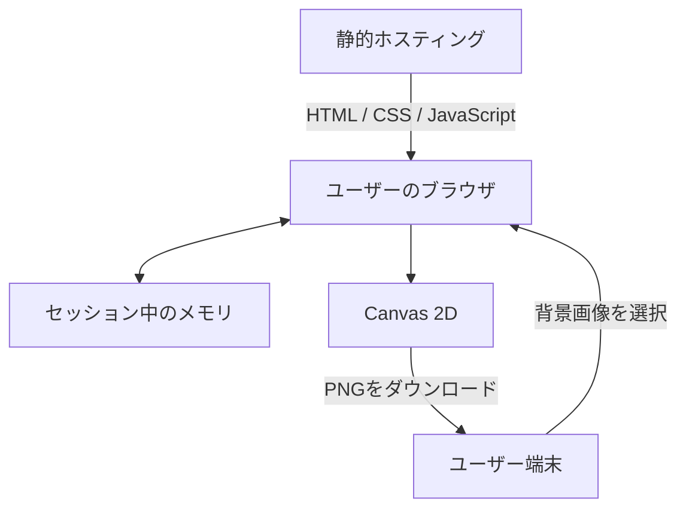

# アーキテクチャ設計書

## 設計判断

このアプリは、入力から出力までが1セッション内で完結し、秘密情報、共有データ、サーバー計算を必要としない。そのため、中央処理を持たない静的Webアプリを採用する。



静的ホスティングからブラウザへの配信だけが中央通信となる。ユーザー入力を逆方向へ送る経路は作らない。

## テクノロジースタック

### 言語・ランタイム

| 技術 | バージョン・条件 | 用途 |
| --- | --- | --- |
| Node.js | 20.19以上、または22.12以上 | 開発・ビルドのみ |
| TypeScript | `~6.0.2` | アプリ実装 |
| npm | lockfileVersion 3対応 | 依存関係管理 |

セットアップ時の検証環境はNode.js 22.15.0、npm 10.9.2。

### フレームワーク・Web API

| 技術 | バージョン | 用途 | 選定理由 |
| --- | --- | --- | --- |
| Vite | `^8.2.0` | 開発サーバーと静的ビルド | 小さい構成と高速な開発体験 |
| Canvas 2D API | ブラウザ標準 | 画像合成と文字描画 | サーバーや外部画像処理ライブラリが不要 |
| `createImageBitmap` | ブラウザ標準 | 画像デコード | 非同期デコードと明示的な解放が可能 |
| `Intl.Segmenter` | ブラウザ標準 | 表示文字単位の分割 | 絵文字や結合文字を単純なUTF-16分割より安全に扱える |

MVPでは実行時依存パッケージを追加しない。テストツールは描画実装時にVitestとPlaywrightを候補として評価する。

## アーキテクチャパターン

```text
UI / App
  ↓ 状態とイベント
ドメインロジック
  ├─ 画像検証・配置計算
  ├─ 文字レイアウト
  └─ 書き出し条件
  ↓ 描画命令
Canvas / Browser Adapter
```

### UIレイヤー

- DOMイベントを受け取り、状態を更新する
- エラーと操作可能状態を表示する
- ドメインロジックとブラウザAdapterを呼び出す
- 文字配置やcover計算を直接実装しない

### ドメインロジック

- 文字列、数値、計測結果からレイアウトを決める
- 画像のcover配置を計算する
- DOM、ファイル、ネットワークへ依存しない

### Browser Adapter

- `File`、`ImageBitmap`、Canvas、Blob、Object URLを扱う
- 外部通信を行わない
- 確保した資産を所有者が明示的に解放する

依存方向はUIからドメインとAdapterへの一方向とし、ドメインからUIやCanvasへ依存しない。

## データ保持

| データ | 保存先 | 寿命 | 理由 |
| --- | --- | --- | --- |
| 背景画像 | ブラウザメモリ | タブを閉じるまで | サーバー保管責任を持たない |
| 見出し・設定 | ブラウザメモリ | タブを閉じるまで | 履歴機能をMVPへ含めない |
| 生成PNG | ユーザーが選ぶ保存先 | ユーザー管理 | アプリ側で保持しない |
| アプリ資産 | HTTPキャッシュ | ホスティング設定に従う | 再訪時の転送を減らす |

Local Storage、IndexedDB、CookieはMVPで使用しない。アクセス解析を導入する場合も画像・見出し・生成内容を扱わない設計レビューを先に行う。

## フォント方針

初期実装は端末の太字日本語ゴシック体を使用し、外部CDNからフォントを読み込まない。候補順は次の通り。

```css
font-family: "Arial Black", "Noto Sans JP", "Yu Gothic", "Hiragino Kaku Gothic ProN", sans-serif;
```

端末差による見た目の差が許容できないと確認された場合のみ、ライセンスと転送量を確認した日本語フォントのサブセット同梱を検討する。

## セキュリティとプライバシー

- ファイル選択は `accept="image/jpeg,image/png,image/webp"` で絞り、容量とデコード結果も検証する
- 見出しはHTMLへ挿入せず、`textContent` またはCanvas APIへ渡す
- サードパーティースクリプト、広告、外部フォントを初期実装へ含めない
- ユーザー入力、ファイル名、Blob URLをログへ出さない
- Blob URLを使用後に `URL.revokeObjectURL` で破棄する
- `ImageBitmap` を差し替え時と画面破棄時に閉じる
- 本番配信ではCSPを設定し、`connect-src 'none'` を出発点にする
- npm lockfileをコミットし、依存更新時に監査とビルドを行う

ファイルのMIME型は信頼境界として扱わず、ブラウザが画像としてデコードできることを確認する。破損ファイルや巨大ファイルでタブを停止させないことを優先する。

## パフォーマンス

| 操作 | 目標 | 測定条件 |
| --- | --- | --- |
| 初期表示 | 2秒以内 | 通常回線、キャッシュなし、一般的なPC |
| 見出し・スライダー反映 | 100ms以内 | 画像デコード後、一般的なPC |
| PNG生成 | 2秒以内 | 1280×720、一般的なPC |

- 描画Canvasは1280×720の1枚に固定する
- 入力イベントごとの重複描画を `requestAnimationFrame` でまとめる
- 同じ画像を設定変更ごとに再デコードしない
- 文字サイズ探索は上限回数のある二分探索とする
- 画像差し替え時に前のデコード結果を解放する

## 静的配信

- `npm run build` の `dist/` を静的ホスティングへ配置する
- ホスティングサービスは公開前に料金、転送量、ビルド上限、規約を比較して決める
- ハッシュ付き資産は長期キャッシュ、`index.html` は短いキャッシュを基本とする
- Service Workerとオフライン対応はMVPへ含めない

## テスト方針

- 純粋なレイアウト計算は単体テストする
- Canvas描画は代表入力のピクセル確認または画像スナップショットで検証する
- 主要操作はE2Eテストし、ダウンロード画像の寸法も確認する
- 主要ブラウザ、360px幅、低性能端末で手動確認する
- 公開前に通信パネルでユーザー入力の外部送信がないことを確認する

## 技術的制約

- Canvasのフォント描画はOSとブラウザで差が出る
- `Intl.Segmenter` 非対応環境は対象外とするか、`Array.from` へ縮退する
- 低メモリ端末では大きな入力画像のデコードに失敗する可能性がある
- ブラウザ内処理のため、厳密に同一なピクセル出力を全端末へ保証しない
- 外部APIキーを安全に保持できないため、秘密情報を必要とする機能は追加できない