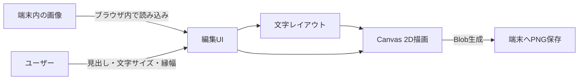
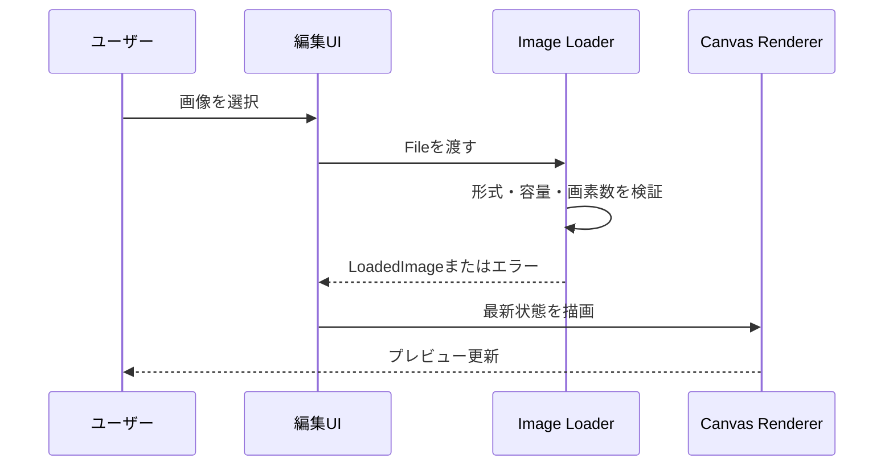

# 機能設計書

## システム構成



静的ホスティングはHTML、CSS、JavaScriptなどのアプリ資産だけを配信する。ユーザーが選んだ画像、入力文字列、生成画像は送信しない。

## 画面設計

### 編集画面

画面は1ページで完結させる。ランディングページやウィザードを挟まない。

操作UIは「背景画像」「文字」の2つの折りたたみパネル（`<details>`）へ分ける。横に広い画面ではプレビューと背景画像パネルを左列、文字パネルと書き出しを右列へ置く。860px以下では同じ順序で1列へ縦積みし、スマートフォンでも各パネルを閉じて操作できるようにする。

背景画像はファイル選択に加え、プレビューと背景画像パネルへのドラッグ＆ドロップでも読み込める。

| 項目 | UI | 初期値 | 補足 |
| --- | --- | --- | --- |
| 背景画像 | ファイル選択 | 未選択 | JPEG、PNG、WebP |
| 画像の拡大率 | スライダー | 100% | 100〜300%、cover配置を100%とする |
| 画像の横位置 | スライダー | 0% | -50〜50%、キャンバス幅に対する移動量 |
| 画像の縦位置 | スライダー | 0% | -50〜50%、キャンバス高に対する移動量 |
| 1行目（白） | 1行テキスト入力 | 空 | 0〜30文字 |
| 2行目 前半（黄） | 1行テキスト入力 | 空 | 0〜30文字 |
| 2行目 後半（赤） | 1行テキスト入力 | 空 | 0〜30文字 |
| 文字サイズ（1行目） | スライダー | 75px | 24〜200px、1px単位 |
| 文字サイズ（2行目） | スライダー | 93px | 24〜200px、1px単位 |
| 縦の画面占有率 | スライダー | 40% | 30〜45%、縦方向の伸縮率を決める |
| 縁取りの太さ | スライダー | 18% | 10〜30%、フォントサイズ比 |
| 書き出し | ダウンロードボタン | 無効 | 画像と見出しが有効な場合だけ有効 |

文字色は入力欄ごとに固定とし、ユーザーは選択しない。1行目は入力欄①、2行目は入力欄②と③を横に連結して描画する。空の行は詰める。

プレビューは16:9を常に維持し、表示サイズだけをレスポンシブに縮小する。描画用Canvasの内部解像度は1280×720に固定する。

## 状態モデル

```typescript
type FillColorId = 'white' | 'yellow' | 'red'

interface HeadlineInput {
  firstLine: string
  secondLineLead: string
  secondLineTail: string
}

interface FontSizes {
  firstLine: number
  secondLine: number
}

interface ImageTransform {
  zoom: number
  offsetX: number
  offsetY: number
}

interface EditorState {
  image: LoadedImage | null
  imageTransform: ImageTransform
  headline: HeadlineInput
  fontSizes: FontSizes
  heightRate: number
  strokeRatio: number
  error: EditorError | null
}

interface LoadedImage {
  bitmap: ImageBitmap
  fileName: string
  width: number
  height: number
}

interface LayoutSegment {
  text: string
  fillColor: string
  width: number
}

interface LayoutLine {
  segments: LayoutSegment[]
  width: number
  fontSize: number
  lineHeight: number
  strokeWidth: number
}

interface TextLayout {
  lines: LayoutLine[]
  verticalScale: number
  region: { x: number; y: number; width: number; height: number }
}
```

編集状態はメモリ内だけに保持する。ページ再読み込み時の復元はMVPへ含めない。

## コンポーネント

| コンポーネント | 責務 | 主な入力・出力 |
| --- | --- | --- |
| App | DOMイベントと状態更新を調停する | UIイベント、`EditorState` |
| Image Loader | ファイル検証、デコード、前画像の解放 | `File` → `LoadedImage` || Text Layout | 文字分割、行幅と行高、縁幅を計算する | 入力欄・文字サイズ・計測関数 → `TextLayout` |
| Canvas Renderer | 背景と見出しを決められた順で描画する | 状態・レイアウト → Canvas |
| Exporter | CanvasをPNG Blobへ変換して保存する | Canvas → `thumbnail.png` |
| Share | 生成PNGと定型文をXへ渡す | Canvas → 共有シートまたはWeb Intent |

UIは描画計算を直接持たない。Text LayoutはCanvasの `measureText` を注入してテスト可能にする。

## 操作フロー

### 背景画像の読み込み



1. `File.type` とブラウザのデコード結果で対応形式を確認する。
2. 20MiBを超える場合はデコード前に拒否する。
3. デコード後に幅×高さを確認し、4000万画素を超える場合は拒否する。
4. 新しい画像を採用した後、前の `ImageBitmap.close()` とObject URLの破棄を行う。
5. エラー時は現在の有効なプレビューを維持する。

### 見出しの編集

1. 3つの入力欄を文字列として状態へ保存する。HTMLとして解釈しない。
2. 入力欄ごとに固定の文字色を割り当て、最大2行の論理行へまとめる。
3. 行ごとの指定文字サイズで幅を計測する。自動改行と自動縮小は行わない。
4. 背景、縁、文字の順でCanvasを再描画する。
5. 幅を超えた場合は中央揃えのまま左右へはみ出させる。

### PNG書き出し

1. 画像と見出しが入力されていることを確認する。
2. 内部解像度1280×720のCanvasを最終描画する。
3. `canvas.toBlob` を `image/png` で実行する。
4. 一時Object URLから `thumbnail.png` をダウンロードする。
5. クリック後に一時Object URLを解放する。

### Xへのシェア

1. クリック直後に `navigator.canShare({ files })` を同期で判定する。PNG生成を待つとポップアップブロックに掛かるため。
2. 対応環境では PNG Blob を `File` へ包み、本文付きで `navigator.share` を呼ぶ。
3. 非対応環境では `https://x.com/intent/tweet` を新規タブで開く。Web Intentは画像添付を扱えないため、画像は手動添付を案内する。
4. いずれの経路でもハッシュタグとツールURLを本文へ含める。
5. `AbortError`（ユーザーのキャンセル）はエラーとして扱わない。

## 描画仕様

### 背景画像

画像は中央基準のcover配置を基準とし、拡大率と平行移動を適用する。

```text
scale = max(1280 / imageWidth, 720 / imageHeight) * zoom
drawWidth = imageWidth * scale
drawHeight = imageHeight * scale
drawX = (1280 - drawWidth) / 2 + offsetX * 1280
drawY = (720 - drawHeight) / 2 + offsetY * 720
```

`zoom` は1.0〜3.0、`offsetX` と `offsetY` は-0.5〜0.5とする。

### 文字領域

```text
canvasWidth = 1280
canvasHeight = 720
safeHorizontalMargin = 64
safeBottomMargin = 0
regionX = safeHorizontalMargin
regionWidth = canvasWidth - safeHorizontalMargin * 2
```

行は画面最下部から上へ積み上げる。各行の行高はその行のフォントサイズ×1.05とし、全体へ縦方向の伸縮率を掛ける。

### 縦方向の伸縮

```text
baseHeight = 各行の行高の合計
targetHeight = canvasHeight * heightRate
verticalScale = targetHeight / baseHeight
```

`heightRate` は0.30〜0.45とする。描画時は行の中心を原点として `scale(1, verticalScale)` を掛けるため、文字幅を変えずに縦長になる。縁取りも同じ割合で縦へ伸びる。

### 文字サイズと幅

1. `Intl.Segmenter('ja', { granularity: 'grapheme' })` で表示文字単位へ分割する。
2. 入力欄の区切りは行境界としては扱わず、色の境界として保持する。
3. フォントサイズは行ごとに24〜200pxで指定する。既定は1行目75px、2行目93pxとする。
4. 行幅が領域幅を超えても改行しない。中央揃えのまま左右へはみ出させる。
5. 縁幅はフォントサイズの10〜30%（既定18%）とし、6〜48pxへ制限する。

描画パラメータ（フォントサイズ範囲と既定値、行高、縁幅、余白、色）は `src/rendering/renderConfig.ts` へ集約し、開発時の調整をその1ファイルで完結させる。

### 文字描画

| 入力欄 | 塗り | 縁 |
| --- | --- | --- |
| 1行目 | `#FFFFFF` | `#111111` |
| 2行目 前半 | `#FFD400` | `#111111` |
| 2行目 後半 | `#FF3B30` | `#111111` |

- 太字の日本語ゴシック体を使用する
- 行単位で中央揃えし、行内は色の区切りごとに左詰めで連続描画する
- `textBaseline = 'middle'`、`lineJoin = 'round'` とする
- 縁が隣の文字の塗りを削らないよう、全行の `strokeText` を先に描き、その後に `fillText` を重ねる
- MVPでは影を追加しない

## エラー処理

| エラー | 処理 | 表示例 |
| --- | --- | --- |
| 非対応形式 | ファイルを採用しない | JPEG、PNG、WebPを選択してください |
| 容量超過 | デコードしない | 画像は20MiB以下にしてください |
| 画素数超過 | デコード結果を解放する | 画像の縦横サイズが大きすぎます |
| デコード失敗 | 現在のプレビューを維持する | 画像を読み込めませんでした |
| PNG生成失敗 | 一時資産を解放する | 画像を書き出せませんでした |

エラーへファイル内容、見出し本文、ブラウザ内部例外の詳細を表示・送信しない。

## テスト戦略

### 単体テスト

- 1文字、長い文字列、絵文字、結合文字の分割
- 行内で黄から赤へ切り替わる区切りの生成
- 指定文字サイズに対する行幅・行高・縁幅の算出
- 領域幅を超えても行が分割されないこと
- cover配置の縦長・横長・同一比率

### 統合テスト

- 画像、見出し、文字サイズ、縦の占有率、縁幅を変更して描画状態が更新される
- 画像を連続で選び直した際に前の資産を解放する
- エラー後も直前の有効なプレビューを維持する

### E2Eテスト

- 画像選択から1280×720 PNGダウンロードまでの主要フロー
- キーボードだけで全操作を完了できる
- 360px幅とデスクトップ幅で操作領域が重ならない
- 外部通信へ入力画像や見出しが含まれない